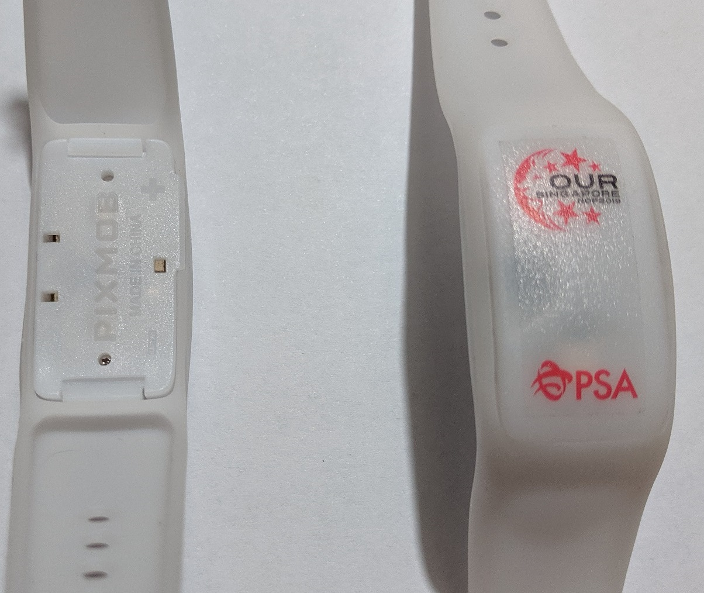
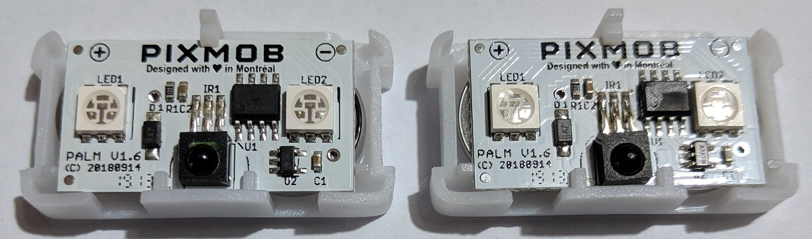
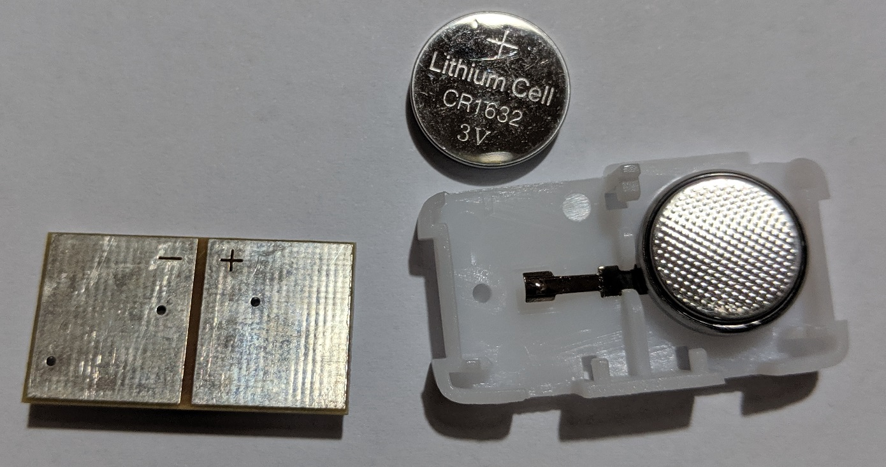
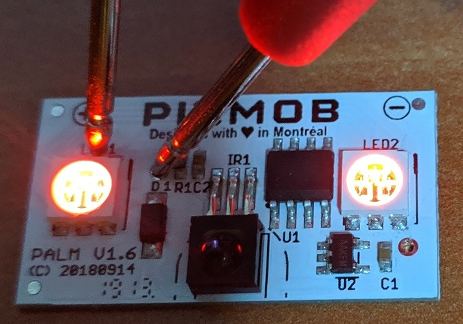
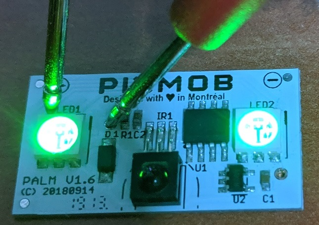
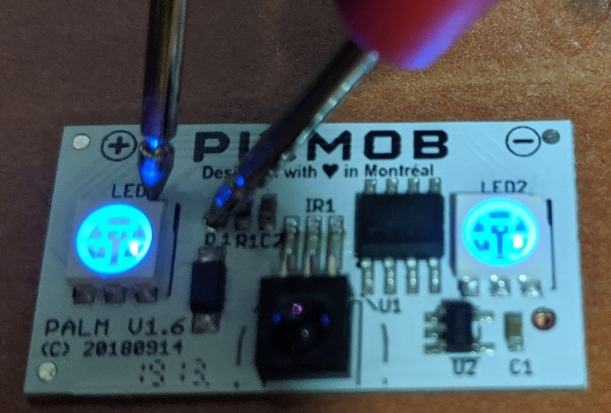
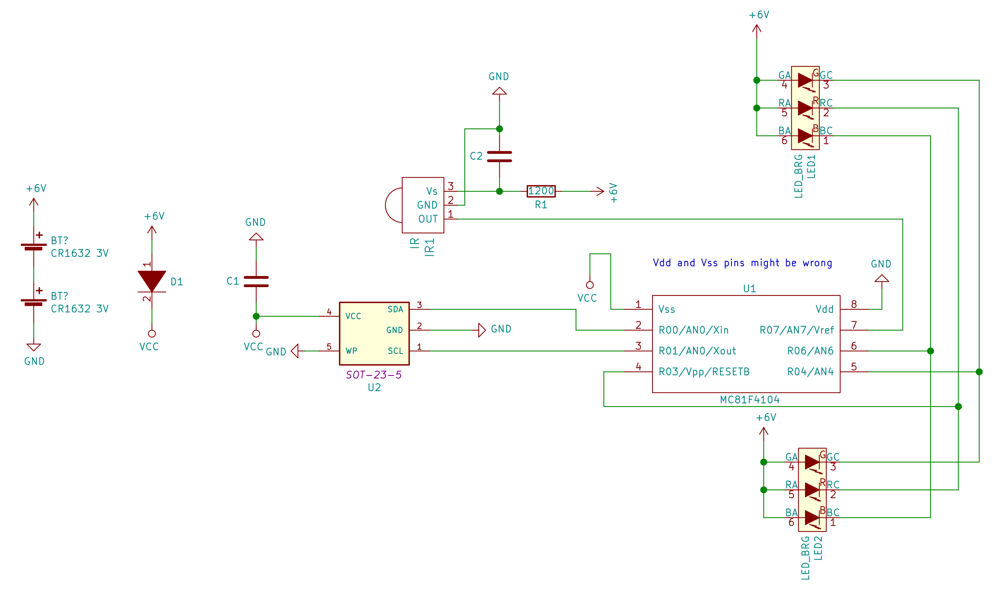
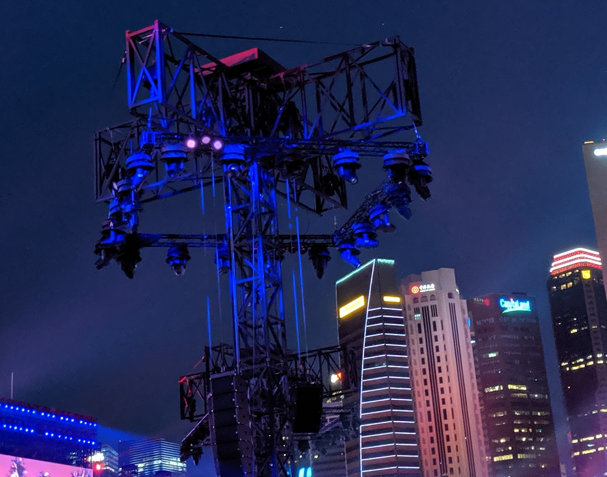

# ndp2019-wristband-teardown

Tear-down effort of the Pixmob wristband used in NDP2019. This wristband was obtained during an NDP preview held on 28 July 2019.

## Background

The Singapore National Day Parade (NDP2016) happened on 9 August 2019 to celebrate its 51st birthday. For those who had the opportunity to attend the actual parade or its previews/rehearsals, they will also get to receive a funpack which one of the items will be a wearable LED band made by the company called [Pixmob](http://pixmob.com/). 

This band receives infrared signals from the organisers and then displays the LED colour of their choosing.

I did a similar project for [NDP2016's wristband](https://github.com/yeokm1/reverse-engineering-ndp2016-wristband).

## Teardown

Opening up the board

Powered by 2x 3V CR1632 connected in series

Red!

Green!

Blue!

## Reverse Engineered Schematic
Using a Multimeter and some trace inspection by eye, I mapped out the connections between the components as shown below. 

The microcontroller chip does not have an IC marking. According to my friend [Jin Gen (@jg_lim)](https://twitter.com/jg_lim) who managed to [run custom code on the NDP2016 wristband](http://jg.sn.sg/ndp-pixmob-1/), whom I'm paraphrasing:

"It is suspected to be the [Abov MC81F4104](http://www.abov.co.kr/en/index.php?Depth1=3&Depth2=1&Depth3=1&Depth4=2&Item=MC81F4104) as it is from the same family as the Abov 81F4204R used in the NDP 2016 wristband. The MC81F4104 suspicion is further cemented by the fact this chip is the only one with the 8-SO package in [Abov’s 8-bit Flash MCU lineup](http://www.abov.co.kr/en/index.php?Depth1=3&Depth2=1&Depth3=1&Depth4=2)."

However if this is true, it seems strange that the Vss is connected to power and Vdd to GND when it is supposed to be vice-versa.

I made some assumptions about the U2 I2C component. I assume it is the same EEPROM used in NDP2016's wristband.

## The Emitter

I can't confirm this but it seems like the infrared emitter is hung on the light tower. The 3 purple infrared emission is visible on my Pixel 2's camera but not to the naked eye.

